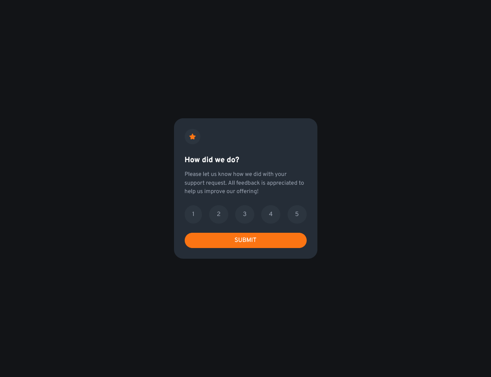

# Frontend Mentor - QR code component solution

This is a solution to the [QR code component challenge on Frontend Mentor](https://www.frontendmentor.io/challenges/qr-code-component-iux_sIO_H). Frontend Mentor challenges help you improve your coding skills by building realistic projects. 

## Table of contents

- [Overview](#overview)
  - [Screenshot](#screenshot)
  - [Links](#links)
- [My process](#my-process)
  - [Built with](#built-with)
  - [What I learned](#what-i-learned)
  - [Continued development](#continued-development)
  - [Useful resources](#useful-resources)
- [Author](#author)

## Overview
Third project down and picking up speed! This project has two display states; a rate this state and an is rated state.

- Planning: 0.5 hours
- Analysis: 0.5 hours
- Design: 0 (Already completed)
- Development: 2 hour
- Testing: 1 hour
- Maintenance: 0 (Not in the scope)

Total: 3 hours

### Screenshot



### Links

- Solution URL: [Add solution URL here](https://github.com/11kyle/interactive-rating-component)
- Live Site URL: [Add live site URL here](https://11kyle.github.io/interactive-rating-component)

## My process

- Planning: My planning for this small project was minimal. I didn't document a project plan.
- Analysis: I selected which languages, frameworks and foundations to use. They are TailwindCSS, Create React App, GitHub Pages. I've been focusing on learning TailwindCSS and that's why is chose it over others like Bootstrap.
- Development: Used VS Code as my IDE. I have experience with MacOS and Windows but chose Windows for this project.
- Testing: Included opening the project in multiple browers and different screen sizes. Also, tested on my iPhone with Safari and Google Chrome by hosting my solution on Github Pages.

### Built with

- Semantic HTML5 markup
- CSS custom properties
- Flexbox
- Mobile-first workflow
- [React](https://reactjs.org/) - JS library
- [Create React App](https://create-react-app.dev/) - React framework
- [Tailwind](https://tailwindcss.com/) - For styles

### What I learned

I learned that if the app crashes due to the tailwind.config.js file, I must stop and restart the dev server after the fix. Page refresh does not clear the error. I also learned how to design a label/input type radio pair. This is really useful for rating applications or other forms that use radio or checkbox inputs. Lastly, I learned about the peer class in TailwindCSS. The ```peer``` class is place on the element before the working element. In this project it looks like this:

```
<label className="peer"></label>
<input className="peer-checked:bg-blue-500 type="radio" Value="1" />
```

One more thing! I knew this before but forgot. You can place the submit button outside of the form. If you do this, you will need to add the ```form``` attribute to the button and a matching ```id``` to the form element.

### Continued development

I want to make both state views the same height and width. This will create a better experience for the user on render.

### Useful resources

- [Stack Overflow](https://stackoverflow.com/) - Possible the best overall place to get help from the community. You can find a solution to every problem you face and if not, post your own.
- [MDN Web Docs](https://developer.mozilla.org/en-US/) - MDN Web Docs are great for reminding you everything you forget. I often use it to look up attributes for html tags and JavaScript methods.
- [TailwindCSS](https://tailwindcss.com/) - This is the documentation for TailwindCSS. It's always open when I use it as my CSS framework.
- [Deploying a React App to GitHub Pages](https://github.com/gitname/react-gh-pages) - This is the documentation on how to deploy a React App to GitHub Pages.

## Author

- Github - [Kyle](https://github.com/11kyle)
- Frontend Mentor - [@11kyle](https://www.frontendmentor.io/profile/11kyle)
- LinkedIn - [Kyle](https://www.linkedin.com/in/kylejohnsondeveloper/)